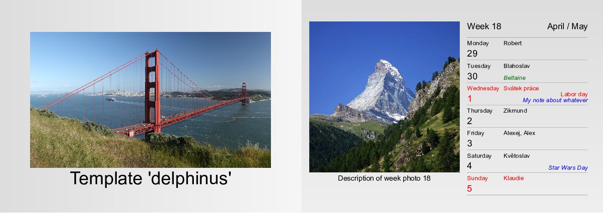
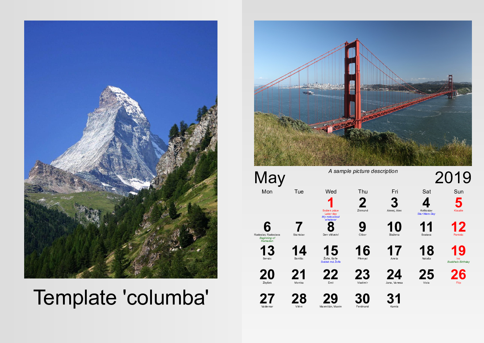
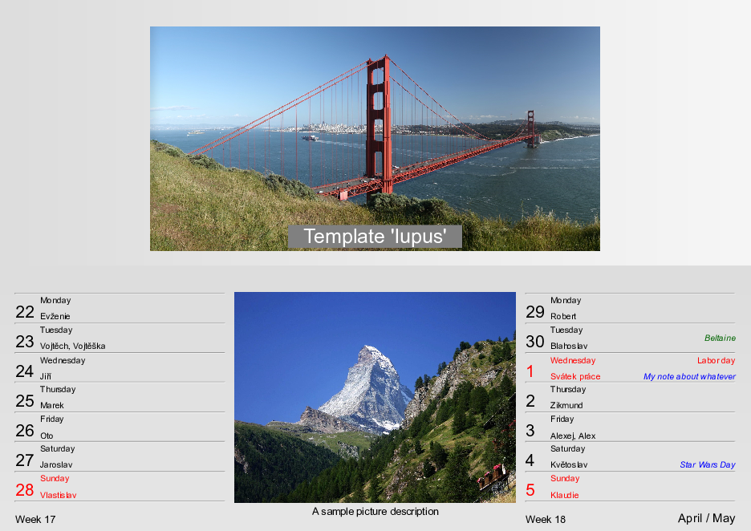

# PhotoCalendar
A [Python](https://python.org) utility to create custom weekly/monthly/... photo calendars.
For example:


## Table of Contents
- [Overview](#overview)
- [Examples](#examples)
	- [Usage](#usage)
	- [Templates](#template-examples)
- [Installation](#installation)
- [What is here](#what-is-here)
- [Contribution](#contribution)
- [License](#license)
- [Acknowledgements](#acknowledgements)

## Overview
The program creates the calendar in HTML format.
> Note: you can then print it to PDF using browser or, e.g., [weasyptint utility](https://weasyprint.org).

User may provide (see [examples below](#examples)):
- name of weekdays and months and their abbreviations
- images (for each week, for title page, for backgrounds)
- name-days
- public holidays
- religious holidays
- notes (friends' birthdays, anniversaries, ...)
- template how the final calendar looks like
- title, first week day, ...

##### HTML templates
The produced HTML structure and CSS styling is defined by template - a python module defining `toHTMLString(calendar)` function and `CSSString` string variable.
As an example and inspiration, a few predefined templates are provided.
See [examples](examples), documentation or source code for more information how to create a custom template.

##### Compatibility
The package works with both Python 2 and 3 (tested on [Ubuntu 16.04 LTS](https://www.ubuntu.com/) and Python 2.7.12 and Python 3.5.2).

## Examples

### Usage

#### Python:
```python
from photocalendar import PhotoCalendar
calendar = PhotoCalendar( # not all arguments are mandatory
	outputBase                = "/some/output/base",
	year                      = 2019,
	firstWeekDay              = "Tu", # Tuesday as the first week day? Well, why not...
	imagesDirectory           = "/some/directory/with/images/for/each/week",
	imageDescriptionsFile     = "/some/file/with/image/descriptions/for/each/week",
	backgroundImagesDirectory = "/some/directory/with/backround/images/for/each/week",
	title                     = "Some calendar title",
	titlePageImage            = "/some/image/for/title/page",
	titlePageBackground       = "/some/background/image/for/titlepage",
	lastPageBackground        = "/some/background/image/for/last/page",
	nameDaysFile              = "/some/file/with/name-days",
	religiousHolidaysFile     = "/some/file/with/religious/holidays",
	publicHolidaysFile        = "/some/file/with/public/holidays",
	notesFile                 = "/some/file/with/notes/like/birthdays/etc",
	weekDayNamesFile          = "/some/file/with/custom/weekday/names",
	abbrWeekDayNamesFile      = "/some/file/with/custom/abbreviated/weekday/names",
	monthNamesFile            = "/some/file/with/custom/month/names",
	abbrMonthNamesFile        = "/some/file/with/custom/abbreviated/month/names",
	template                  = "delphinus",
)
calendar.toHTML()
```

#### Shell:
```shell
# not all arguments are mandatory
photocalendar \
	--output-base                 /some/output/base \
	--year                        2019 \
	--first-week-day              Tu \
	--images-directory            /some/directory/with/images/for/each/week  \
	--image-descriptions-file     /some/file/with/image/descriptions/for/each/week \
	--background-images-directory /some/directory/with/backround/images/for/each/week \
	--title                       "Some calendar title" \
	--title-page-image            /some/image/for/title/page \
	--title-page-background       /some/background/image/for/titlepage \
	--last-page-background        /some/background/image/for/last/page \
	--name-days-file              /some/file/with/name-days \
	--religious-holidays-file     /some/file/with/religious/holidays \
	--public-holidays-file        /some/file/with/public/holidays \
	--notes-file                  /some/file/with/notes/like/birthdays/etc \
	--week-day-names-file         /some/file/with/custom/week/day/names \
	--abbr-week-day-names-file    /some/file/with/custom/abbreviated/week/day/names \
	--month-names-file            /some/file/with/custom/month/names \
	--abbr-month-names-file       /some/file/with/custom/abbreviated/month/names \
	--template                    delphinus
```

### Template examples
> Note:
> the photos and backgrounds are only illustrative.
> They are provided by the user in the real use case.

The title page and one inside page is shown.

In the illustrations,
[picture](https://upload.wikimedia.org/wikipedia/commons/d/d1/Golden_Gate_1.jpg)
of
[Golden Gate Bridge](https://en.wikipedia.org/wiki/Golden_Gate_Bridge)
and
[picture](https://upload.wikimedia.org/wikipedia/commons/4/4c/Matterhorn_from_Zermatt2.jpg)
of
[Matterhorn](https://en.wikipedia.org/wiki/Matterhorn)
are used.

#### Template delphinus:
Weekly A5 landscape calendar


#### Template columba:
Monthly A4 portrait calendar


#### Template lupus:
Two-weeks calendar


## Installation
1. Using `setup.py` file:

	`python setup.py install [options]`, e.g. `python setup.py --user`

2. Using `make` (calls `setup.py` internally):

	`make install [options]`, e.g. `make install USER=TRUE PYTHON=python3`

## What is here
| file/directory | description |
| --- | --- |
| [bin](bin) | directory containing executable python script |
| [doc](doc) | source files for HTML documentation |
| [examples](examples) | directory with examples |
| [images](images) | images for github page (e.g., templates illustrations) |
| [locale](locale) | files for localization (public holidays, name days, etc.) |
| [Makefile](Makefile) | makefile for the project (with targets `help`, `install`, `doc`, `test`, `clean`) |
| [photocalendar](photocalendar) | actual python package |
| [setup.py](setup.py) | python setup file for installation |
| [tests](tests) | python unit tests |

## Contribution
#### Pull Requests
Are welcome. Especially:
- locales (name-days, public holidays)
- templates

But, please, discuss the intention beforehand with the author.

#### Bug reporting
In case of any question or problem, please leave an issue at the [githup page of the project](https://github.com/stranskyjan/photo-calendar).

#### Contributors
- [Jan Stránský](https://github.com/stranskyjan)

## License
This project is licensed under the LGPL License - see the [license file](LICENSE) for details.

## Acknowledgements
- to Petr Hlaváček for the inital idea and LaTeX implementation and providing his source code
- to [dominate python package](https://github.com/Knio/dominate) for HTML creation inspiration
