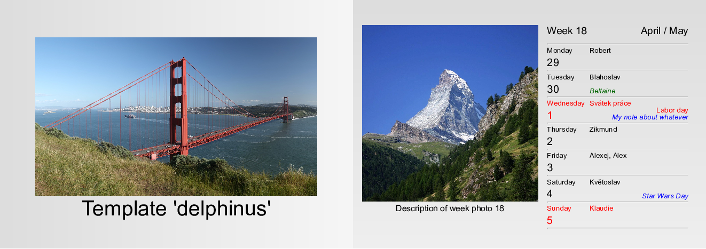
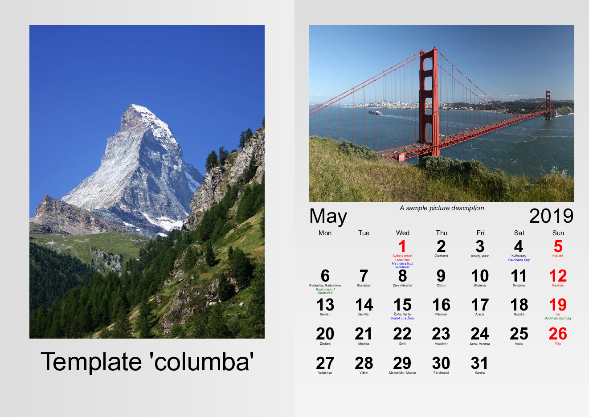
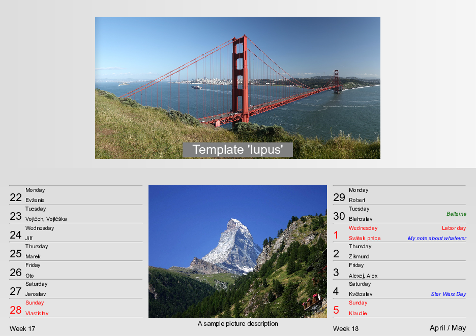

.. toctree::
   :maxdepth: 2

PhotoCalendar documentation
***************************
.. automodule:: photocalendar

PhotoCalendar module
====================

Auxiliary classes
-----------------
.. autoclass:: photocalendar.photocalendar.Day
	:members:

.. autoclass:: photocalendar.photocalendar.Week
	:members:

.. autoclass:: photocalendar.photocalendar.Month
	:members:

PhotoCalendar class
-------------------
.. autoclass:: photocalendar.PhotoCalendar
	:members:

.. _section-templates:

Templates
=========
.. automodule:: photocalendar.templates
	:members: loadTemplate, loadCSS

HTML file creation
------------------
.. automodule:: photocalendar.templates.html
	:members:

Template **delphinus**
----------------------
.. automodule:: photocalendar.templates.delphinus

Template **columba**
----------------------
.. automodule:: photocalendar.templates.columba

Template **lupus**
----------------------
.. automodule:: photocalendar.templates.lupus

Command line usage
==================
The package also provides a command line tool :code:`photocalendar`.
Its parameters mirrors those of :class:`photocalendar.PhotoCalendar`.
See examples or run :code:`photocalendar --help` for more info.
